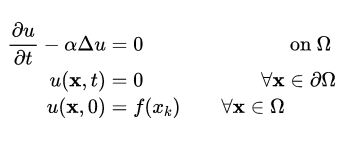
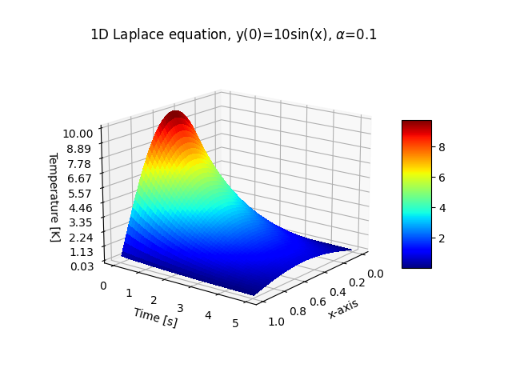

# heat

Implementation of n-dimensional solver for Laplace's equation with the following formulation:

using a second-order scheme in space and a Backward Euler scheme in time. To solve the resulting linear system,
conjugate gradient method is used.

### example:
initial condition of y(t=0) = 10sin(x) with diffusion coefficient of 0.1

